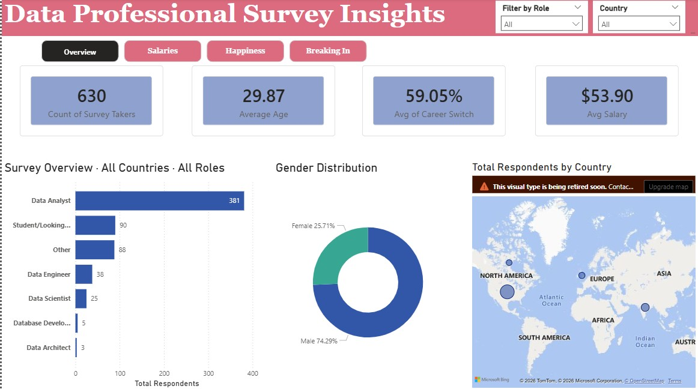
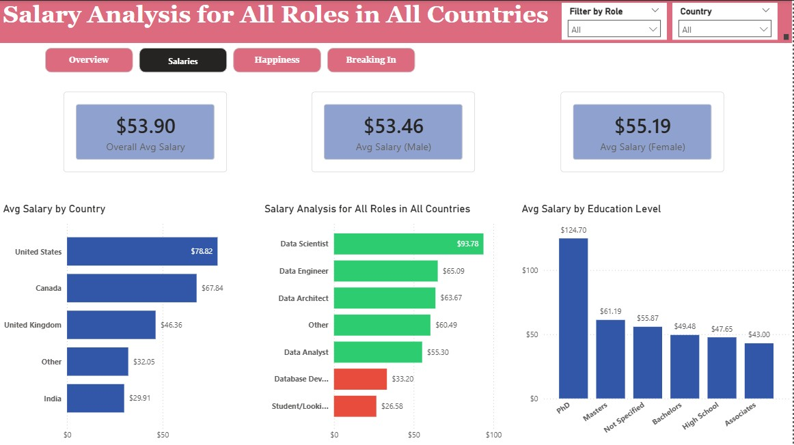
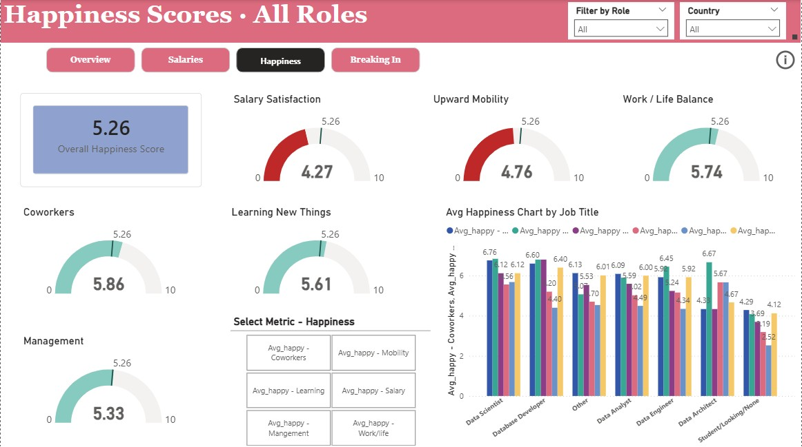
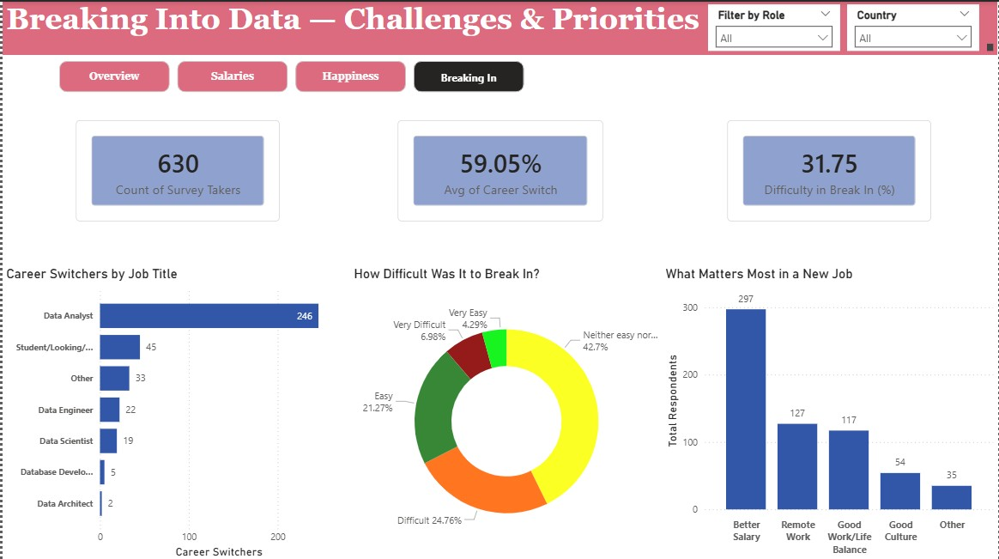

# Data Professionals Survey Dashboard

A multi-page interactive Power BI dashboard built on a survey 
of 630 data professionals, analysing salary trends, happiness 
scores, and career entry challenges.

---

## Dashboard Preview

### Page 1 — Overview

### Page 2 — Salaries

### Page 3 — Happiness

### Page 4 — Breaking In

---

## 🛠️ Tools Used
- Power BI Desktop
- Power Query (data cleaning)
- DAX (measures and calculated columns)

---

## ✨ Features
- Custom button-based page navigation
- Dynamic chart titles using DAX measures
- Conditional formatting driven by DAX (salary chart)
- Field Parameters for switchable metrics
- Tooltip pages on hover
- Synced slicers across all pages

---

## 📁 Dataset
- 630 survey respondents
- Source: Alex The Analyst (Power BI Final Project dataset)
- Cleaned and transformed in Power Query

---

## 📊 Key Insights
- Average salary across all data roles: $53.90
- Salary satisfaction is the lowest happiness dimension at 4.27/10
- 59.05% of respondents switched careers to enter data
- Data Scientists earn the highest average salary at $93.78

---

## 🔎 How to View
1. Download the `.pbix` file
2. Open with [Power BI Desktop](https://powerbi.microsoft.com/desktop) (free)
